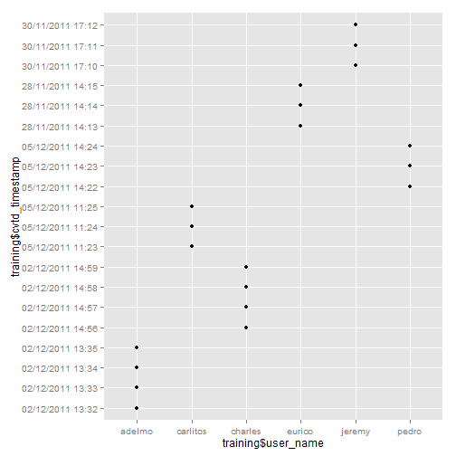
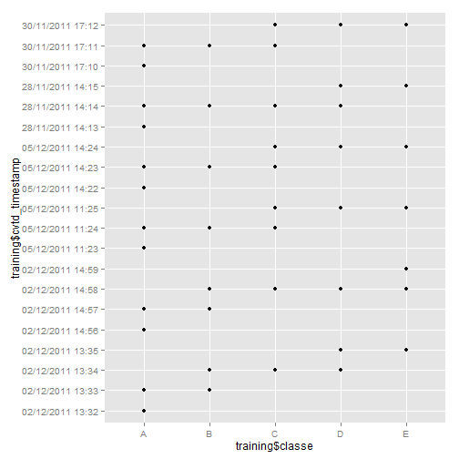

Practical Machine Learning - Course Project
========================================================

First we downloaded the "testing" and "training" datasets.
The "training" dataset will be referred to as "training_full" because it
will be subdivided into new training and testing sets for model building.
The "testing" data set will be referred to as "validation", because it
will be used to validate our final model. The results of our final model applied to
the "validation" data set will then be submitted for grading on Coursera.


```r
# Downloads data
url <- "https://d396qusza40orc.cloudfront.net/predmachlearn/pml-training.csv"
download.file(url, destfile = "training_full.csv")
```

```
## Error: unsupported URL scheme
```

```r
url <- "https://d396qusza40orc.cloudfront.net/predmachlearn/pml-testing.csv"
download.file(url, destfile = "validation.csv")
```

```
## Error: unsupported URL scheme
```

```r
# Loads training.csv and validation.csv
# The na.strings argument ensures that blank or unusable values are converted to NA

training_full <- read.csv("training_full.csv", na.strings= c("", " ", "na", "Na", "NA", "#DIV/0!"))
validation <- read.csv("validation.csv", na.strings= c("", " ", "na", "Na", "NA", "#DIV/0!"))
```

Inspection of the variables for NA values revealed that many variables were composed almost entirely of NA's and could therefore be deleted from the data set without hindering out ability to predict. Any variable with over 1000 NA's was removed from both data sets.


```r
# Checks the number of NA's in each column and removes those with excessive NA's

na_vars <- sapply(training_full, function(x) {length(which(is.na(x)))})
training_full <- training_full[ , na_vars < 1000 ]
validation <- validation[ , na_vars < 1000 ]
```

We investigated the "classe" variable and saw that it is a factor variable with 5 levels. This is the variable we will attempt to predict.


```r
str(training_full$classe)
```

```
##  Factor w/ 5 levels "A","B","C","D",..: 1 1 1 1 1 1 1 1 1 1 ...
```

```r
summary(training_full$classe)
```

```
##    A    B    C    D    E 
## 5580 3797 3422 3216 3607
```

Next we loaded the caret package and used it to partition the full training set
into training and testing subsets called "training" and "testing".

It should be noted that previous references to inspection of the data actually occurred after the data was partitioned, and were limited to the newly created
"training" dataset. This helped prevent knowledge of the testing set from biasing
our results.


```r
## loads caret package and splits the "training_full" dataset
## into two subsets: "training" and "testing"

library(caret)

intrain <- createDataPartition(training_full$classe, p = .60, list = F)
training <- training_full[intrain, ]
testing <- training_full[-intrain, ]
```

We created a table of the variable "user_name" and discovered that there were 
six participants in the study. By plotting "username" against the variable 
"cvtd_timestamp" we determined that the data was collected over a different
2-3 minute time period for each participant. By plotting "classe" against
"cvtd_timestamp" we also determined that participants performed each "classe"
in the same order. 


```r
# Exploratory table and plots
table(training$user_name)
```

```
## 
##   adelmo carlitos  charles   eurico   jeremy    pedro 
##     2351     1816     2128     1826     2084     1571
```

```r
qplot(training$user_name, training$cvtd_timestamp)
```

 

```r
qplot(training$classe, training$cvtd_timestamp)
```

 
  
  We chose to delete these variables along with
others that seems unrelated to position data and which might prevent our model
from generalizing to new data. These constituted the first seven variables of the data set.


```r
## Eliminates extraneous variables
training <- training[, -c(1:7) ]
testing <- testing[, -c(1:7) ]
validation <- validation[ , -c(1:7)]
```

  We decided to build our first potential prediction model using decision trees
because the outcome variable is categorical. trControl was set to method ="cv"
for cross-validation and five folds were used. This produced an extremely
inaccurate model as seen in the confusion matrix.


```r
set.seed(91660)

library(rpart)

# Trains model and produces confusion matrix

treeMod <- train(classe ~ ., method = "rpart", data = training,
                 trControl = trainControl(method = "cv", number = 5))
cm <- confusionMatrix(treeMod)
cm
```

```
## Cross-Validated (5 fold) Confusion Matrix 
## 
## (entries are percentages of table totals)
##  
##           Reference
## Prediction    A    B    C    D    E
##          A 25.6  8.2  8.1  7.6  2.6
##          B  0.4  6.6  0.6  3.0  2.5
##          C  2.0  3.5  8.3  4.5  4.0
##          D  0.3  1.0  0.5  1.4  1.2
##          E  0.2  0.0  0.0  0.0  8.1
```

The accuracy rate is only 50%; far too low for a predictive model.


```r
# Sums diagonal of the table in cm to find accuracy

sum(diag(cm$table))
```

```
## [1] 50
```

Our next attempt used random forests. The randomForest() function cross-validates internally, so no specific cross-validation parameters needed to be set. The confusion matrix of the model showed excellent prediction, with an accuracy rate
of 99%. 


```r
library(randomForest)

# Trains model and produces confusion matrix

rfMod <- randomForest(classe ~ ., data = training)
rfMod$confusion
```

```
##      A    B    C    D    E class.error
## A 3345    2    0    0    1   0.0008961
## B   15 2258    6    0    0   0.0092146
## C    0   20 2030    4    0   0.0116845
## D    0    0   24 1905    1   0.0129534
## E    0    0    2    7 2156   0.0041570
```

```r
# Finds accuracy by summing diagonal of confusion matrix and dividing by
# the number of observations
sum(diag(rfMod$confusion))/dim(training)[1]
```

```
## [1] 0.993
```

The out of sample error rate should be approximately .7%


```r
# Finds out-of-bag error rate
rfMod$err.rate[500,1]
```

```
##      OOB 
## 0.006963
```

This model was used to predict on the testing set and preformed even better than
it had previously. We can be sure our model was not overfit because we did not lose prediction accuracy. Our error rate on the test set was consistent with our estimation.


```r
rfPredict <- predict(rfMod, testing)
confusionMatrix(rfPredict, testing$classe)
```

```
## Confusion Matrix and Statistics
## 
##           Reference
## Prediction    A    B    C    D    E
##          A 2231   10    0    0    0
##          B    1 1502   15    0    0
##          C    0    6 1351   19    0
##          D    0    0    2 1267    1
##          E    0    0    0    0 1441
## 
## Overall Statistics
##                                         
##                Accuracy : 0.993         
##                  95% CI : (0.991, 0.995)
##     No Information Rate : 0.284         
##     P-Value [Acc > NIR] : <2e-16        
##                                         
##                   Kappa : 0.991         
##  Mcnemar's Test P-Value : NA            
## 
## Statistics by Class:
## 
##                      Class: A Class: B Class: C Class: D Class: E
## Sensitivity             1.000    0.989    0.988    0.985    0.999
## Specificity             0.998    0.997    0.996    1.000    1.000
## Pos Pred Value          0.996    0.989    0.982    0.998    1.000
## Neg Pred Value          1.000    0.997    0.997    0.997    1.000
## Prevalence              0.284    0.193    0.174    0.164    0.184
## Detection Rate          0.284    0.191    0.172    0.161    0.184
## Detection Prevalence    0.286    0.193    0.175    0.162    0.184
## Balanced Accuracy       0.999    0.993    0.992    0.992    1.000
```

We then made predictions on the validation set for submission


```r
finalPredict <- predict(rfMod, validation)
```
